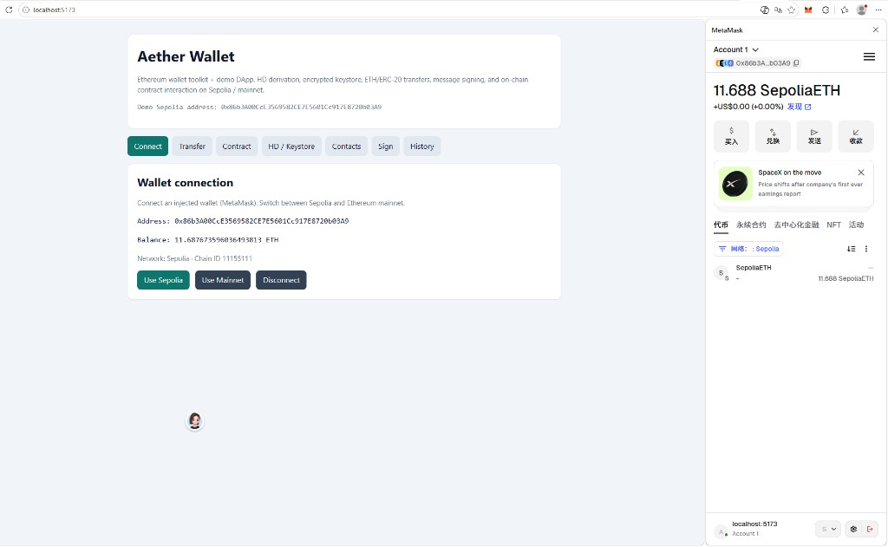
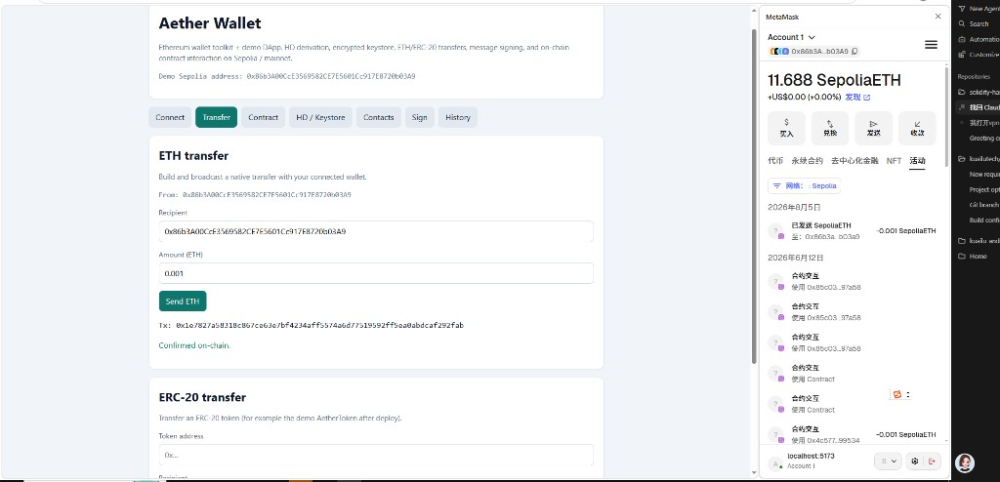
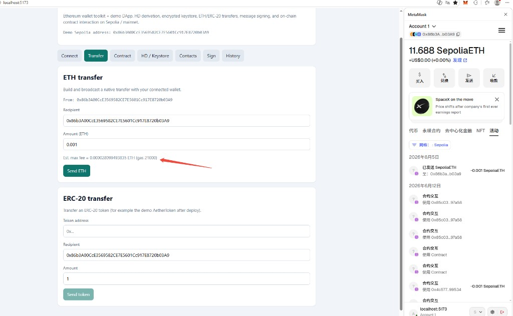
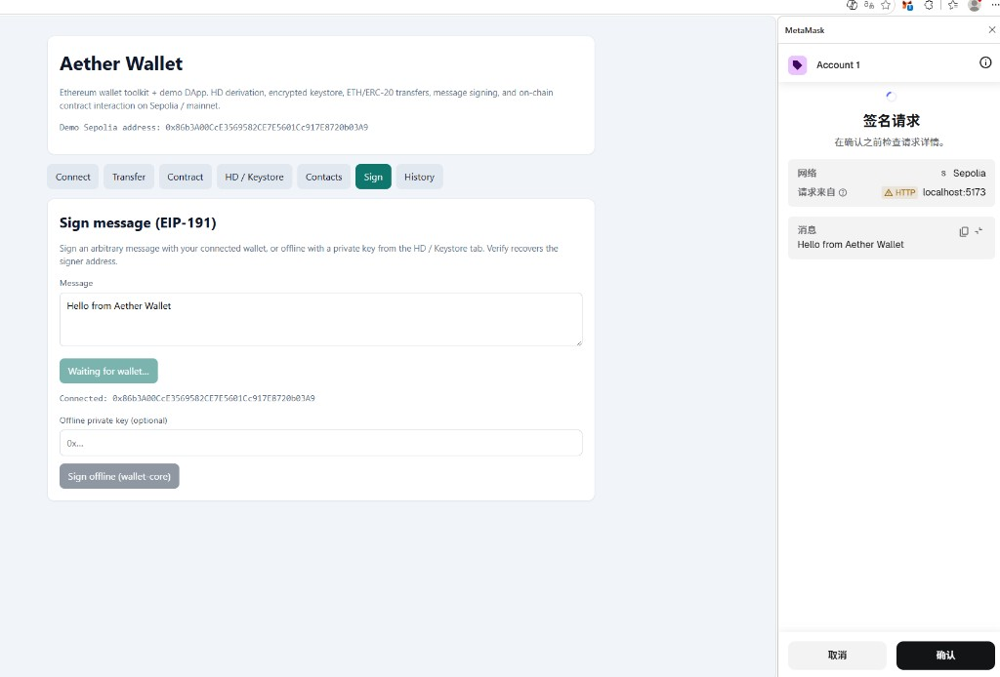
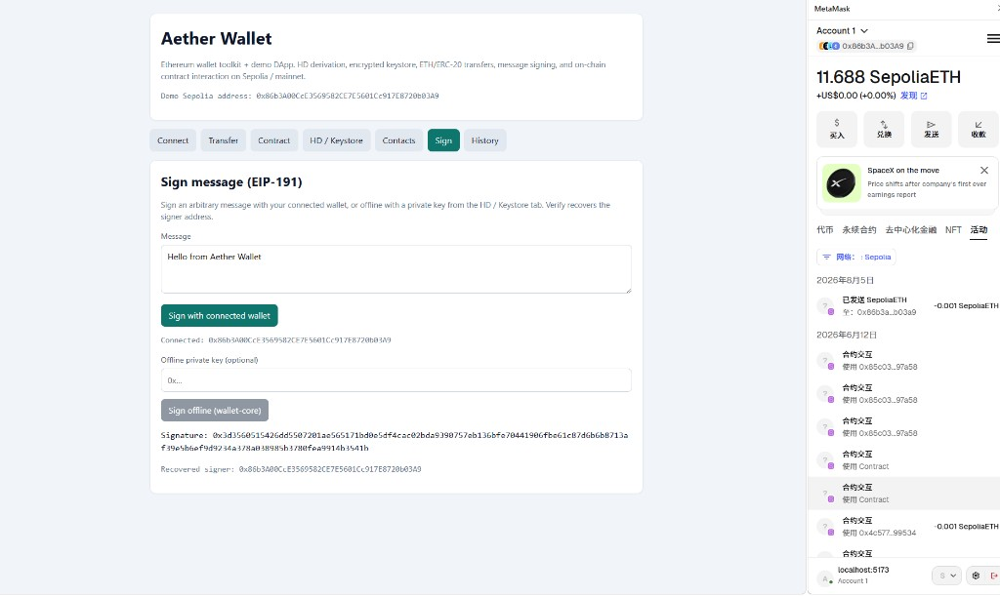
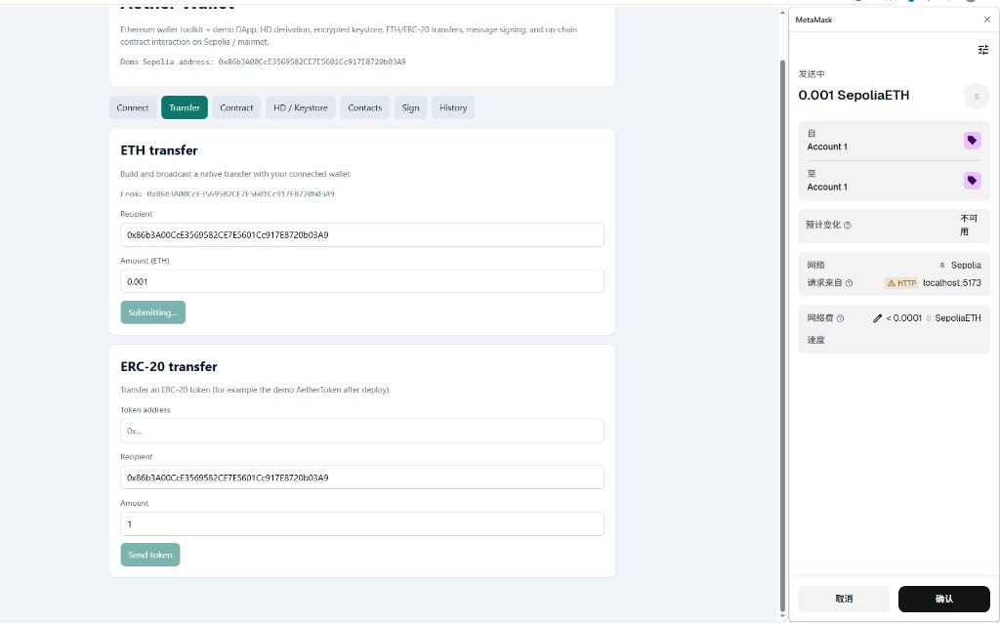

# Aether Wallet

Modern Ethereum wallet toolkit and demo DApp.

This repository shows end-to-end Web3 skills: HD wallet primitives, encrypted keystore handling, transaction signing/broadcast, Solidity contract development, and a React DApp that talks to Sepolia / Ethereum mainnet.

## Links

- **Live demo:** [https://aether-wallet-dapp.vercel.app](https://aether-wallet-dapp.vercel.app)
- **Source:** [github.com/llanglese/aether-wallet](https://github.com/llanglese/aether-wallet)

Open the live demo in Chrome/Edge with MetaMask, switch to **Sepolia**, then connect. Localhost is only for development on your machine.

## Screenshots

Connected wallet on Sepolia:



ETH transfer confirmed on-chain:



ETH transfer page showing estimated max fee (Gas):



EIP-191 message signing (MetaMask request):



Signature recovered to the connected address:



Transfer confirmation with network fee (Gas) in MetaMask:



## Features

- HD wallet (BIP39 / BIP32 / BIP44) mnemonic generation and account derivation
- Private key export and Ethereum Keystore V3 encrypt / decrypt (import)
- ETH and ERC-20 balance helpers
- Transaction build → sign → broadcast utilities (ethers v6)
- Gas fee estimate helpers for native transfers
- EIP-191 personal message sign + recover
- Local address book (browser localStorage)
- ERC-20 token watchlist + approve / allowance UI
- Demo DApp: wallet connect (copy address), ETH/ERC-20 transfer, Guestbook contract calls
- Local transaction history with Etherscan / Sepolia explorer links
- Sample Solidity contracts (`AetherToken`, `Guestbook`) with Hardhat tests and deploy scripts

## Stack

| Area | Tech |
|---|---|
| Wallet core | TypeScript, ethers v6, Vitest |
| Contracts | Solidity 0.8.24, Hardhat |
| DApp | React 18, Vite, Wagmi, Viem |
| Tooling | pnpm workspaces |

## Repository layout

```text
aether-wallet/
  packages/wallet-core/   # HD, keystore, balance, transfer helpers
  contracts/              # Hardhat Solidity project
  apps/dapp/              # React demo UI
```

## Quick start

Requirements: Node.js 20+, pnpm 9+.

```bash
cd D:\aether-wallet
pnpm install
pnpm test
pnpm --filter @aether/dapp dev
```

Open http://localhost:5173

### Tests only

```bash
pnpm test:core        # wallet-core Vitest
pnpm test:contracts   # Hardhat tests
```

## Deploy contracts to Sepolia

Use a **throwaway** deployer key funded with Sepolia ETH. Never commit private keys.

1. Copy root [`.env.example`](.env.example) to `.env` and set:
   - `SEPOLIA_RPC_URL`
   - `DEPLOYER_PRIVATE_KEY`
2. Deploy:

```bash
cd contracts
pnpm exec hardhat run scripts/deploy.ts --network sepolia
```

3. Put the printed addresses into `apps/dapp/.env`:

```bash
VITE_GUESTBOOK_ADDRESS=0x...
VITE_AETHER_TOKEN_ADDRESS=0x...
VITE_SEPOLIA_RPC_URL=https://rpc.sepolia.org
```

4. Restart the local DApp (`pnpm --filter @aether/dapp dev`).

### Wire the live demo (Vercel)

1. Vercel → project `aether-wallet-dapp` → **Settings → Environment Variables**
2. Add for Production (and Preview if you want):
   - `VITE_GUESTBOOK_ADDRESS`
   - `VITE_AETHER_TOKEN_ADDRESS`
   - `VITE_SEPOLIA_RPC_URL` (optional; defaults work)
3. **Deployments → Redeploy** the latest production deployment (env vars are baked in at build time for Vite).

After redeploy, Contract + ERC-20 panels on https://aether-wallet-dapp.vercel.app use the on-chain addresses.

## Demo Sepolia address

Public address used in transfer demos / docs:

`0x86b3A00CcE3569582CE7E5601Cc917E8720b03A9`

Do not commit mnemonics or private keys.

## Who this is for

If you need custom smart contracts, a wallet/DApp integration, or Sepolia → mainnet delivery, this repo is a practical sample of how I structure and ship that work.

## License

MIT
